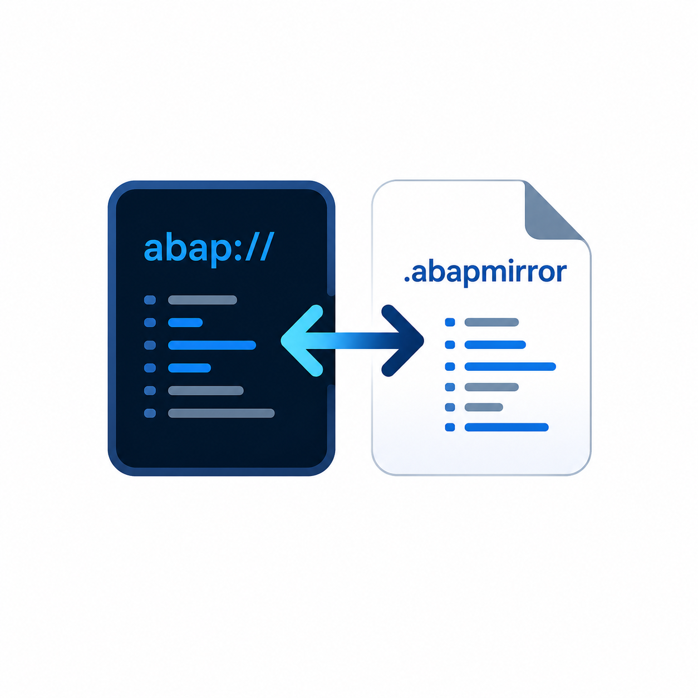

  

<h1 align="center">ABAP Claude Mirror</h1>

  Lets <a href="https://claude.com/claude-code">Claude Code</a> read and edit ABAP objects opened through
  SAP's ABAP Development Tools (ADT) for VS Code — safely, with every change staying under your review.

---

## Why this exists

The [ABAP Development Tools for VS Code extension](https://marketplace.visualstudio.com/items?itemName=SAPSE.adt-vscode)
(`SAPSE.adt-vscode`) opens ABAP repository objects — programs, classes, CDS views, and more — under a virtual `abap://` URI scheme. The
object's source lives entirely in VS Code's in-memory document model, streamed live from the SAP system; it is
**never a real file on disk**.

That's a problem for AI coding assistants like Claude Code, which read and write through the real OS filesystem.
From Claude's point of view, an open `abap://` tab simply doesn't exist — it can't read the code you're looking at,
and it can't propose an edit to it.

**ABAP Claude Mirror** closes that gap. It mirrors whatever ABAP object you have open to a real file on disk, keeps
it in sync in both directions, and gets out of the way otherwise. Claude Code (or any other tool that only
understands real files) can now work with the ABAP code you're actively looking at in ADT.

## Features

- **Automatic mirroring** — open any object in ADT and its source is written to a real file under
  `~/.claude-abap-mirror/`, nested in a folder tree that matches the object's repository path.
- **Two-way live sync** — keep typing in the ADT tab and the mirror updates automatically; edit the mirror file
  (by hand, or by asking Claude Code to change it) and the change flows back into the ADT document buffer.
- **Opens once, then stays out of your way** — the mirror pane reveals itself automatically the first time you
  look at a given object. After that, switching tabs away and back won't keep stealing focus back to it.
- **Open it back up anytime** — right-click any ADT `abap://` document and choose **ABAP Claude Mirror - Open
  Mirror Object**, or run the same command from the Command Palette.
- **ABAP-flavored syntax highlighting** in the mirror view — comments, strings (including `|string templates|`),
  numbers, keywords, operators, and punctuation are colored to match ADT's own conventions.
- **One-flag kill switch** — `abapClaudeMirror.enabled` turns the whole thing off instantly, no reload required.

## How it works

1. You open (or switch focus to) an ABAP object in ADT.
2. The extension writes its current text to a mirror file under `~/.claude-abap-mirror/`.
3. The mirror opens beside the original the first time, so Claude Code's active-file context picks up a real,
   readable file.
4. From then on, edits on either side are synced to the other automatically — no need to keep both tabs focused.

## Safety model — nothing reaches SAP without your say-so

Syncing an edit back only updates the **in-memory buffer** of the ADT tab. It never calls `document.save()` and
never triggers ADT's activate/transport flow. You'll see the change land in the ADT editor with the normal
unsaved-changes indicator — nothing reaches the SAP backend until you review it yourself and save/activate through
ADT as usual (`Ctrl+S`, or ADT's own Activate command).

If the original ADT tab has already been closed, a change to its mirror file can't be pushed anywhere — you'll get
a warning notification instead of the edit silently vanishing.

## Getting started

1. Install this extension alongside `sapse.adt-vscode`.
2. Open any ABAP object through ADT as you normally would.
3. That's it — the mirror file appears automatically, and Claude Code can read/edit it like any other file in your
   workspace.

## Commands & context menu

| Command | What it does |
|---|---|
| **ABAP Claude Mirror - Open Mirror Object** | Opens (or refocuses) the mirror file for the active ABAP document. Available via right-click in the editor, on the editor tab, or the Command Palette. |

## Settings

| Setting | Default | Description |
|---|---|---|
| `abapClaudeMirror.enabled` | `true` | Turn mirroring on or off. Takes effect immediately, no reload needed. When off, no mirror files are created/updated and nothing is synced back into `abap://` documents; existing mirror files are left untouched. |

## Where mirror files live

`~/.claude-abap-mirror/` — one file per ABAP object, nested in folders that match its repository path (so paths
stay unique), with a short, readable leaf filename, e.g. `abapClaudeMirror - zdemo.prog.abap.abapmirror`. That's
also what shows up as the tab title. Safe to delete at any time — it's regenerated the next time you open the
corresponding object.

## Known limitations

- Only `abap://` documents are mirrored.
- A brand-new object needs to be focused at least once before its mirror file exists.
- No conflict resolution — if you edit both the ADT tab and the mirror file at the exact same moment, whichever
  write lands last wins.
- The bundled grammar is a close approximation of ADT's own ABAP highlighting rather than a byte-for-byte copy, so
  colors can differ slightly depending on your theme.

## Contributing

Issues and pull requests are welcome once this repo is public — see the project's GitHub page for details.

## License

MIT
